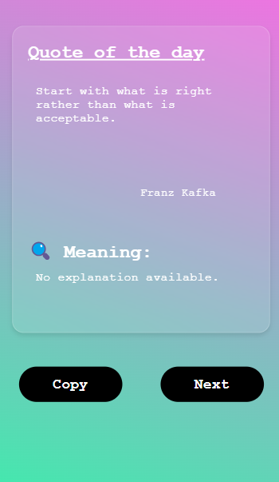

# 🌟 Motivational Quotes Web App

This is a beautiful, responsive web app that displays random motivational quotes with cool text animations and AI-generated explanations. It allows users to copy quotes and load new ones with a single click.

---

## 🚀 Features

- 🎯 Fetches random motivational quotes from the [Quotable API](https://api.quotable.io).
- 🎨 Stylish **glassmorphism-inspired UI** with vibrant gradient background.
- 🔁 **Smooth text animation effect** when quote or author appears.
- 📋 **Copy button** to easily copy the quote to clipboard.
- 🔄 **Next button** to load a new quote.
- 💬 **Generates simple explanations** of each quote using OpenAI's GPT-3.5 API.

---

## 📷 Preview



---

## 🛠️ Technologies Used

- **HTML5** - Markup structure  
- **CSS3** - Styling (Flexbox, gradients, blur effects)  
- **JavaScript (Vanilla JS)** - API handling, DOM manipulation, animations  
- **OpenAI GPT-3.5 API** - Quote explanation  
- **Quotable API** - Random quote fetching

---

## 📦 How It Works

1. On page load, fetches a random quote from Quotable API.
2. Applies a "typing-style" animation effect on both the **quote** and **author** using `textEffect()` function.
3. Uses **OpenAI GPT API** to get a simple explanation of the quote.
4. Two interactive buttons:
   - `Copy`: Copies the current quote to clipboard.
   - `Next`: Loads a new quote with animation and explanation.

---

## 📂 Project Structure


---

## 🔑 API Keys Required

To use OpenAI integration, follow these steps:

1. Get your OpenAI API key from [OpenAI Dashboard](https://platform.openai.com/account/api-keys)
2. Replace this line in the script:

```js
const apiKey = "your-api-key-here"; // Replace with your actual API key
```

## 🧠 Text Animation Logic

The `textEffect()` function animates the text like a **"hacker-style reveal"** by:

- Cycling random characters (`A-Z`, `a-z`, symbols)
- Gradually replacing them with the actual quote text
- Creating a dynamic and engaging user experience

---

## 📝 Future Improvements

- Add quote categories (e.g., success, love, growth)
- Save favorite quotes locally
- Share quotes directly to social media
- Improve mobile responsiveness
- Host with a serverless backend to protect the API key

---

## 📜 License

**MIT License**  
Feel free to use and modify with proper credit.  
© 2025 **Sharwan Jung Kunwar**

---

## 🙌 Acknowledgements

- [Quotable API](https://api.quotable.io)
- [OpenAI GPT-3.5](https://platform.openai.com/)
- Inspiration from modern UI/UX design patterns
